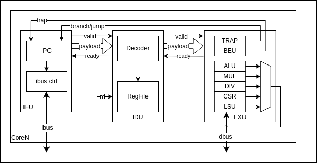

# CoreN

- [CoreN](#coren)
  - [Introduction](#introduction)
  - [ISA](#isa)
  - [Architecture](#architecture)
  - [Parameter and Top Level Interface](#parameter-and-top-level-interface)
    - [Parameter](#parameter)
    - [Top Level Interface](#top-level-interface)
  - [Block Diagram](#block-diagram)
  - [Implementation](#implementation)
  - [Top Level SoC](#top-level-soc)

## Introduction

CoreN stands for Core Non-pipeline. It's a single/multi-cycle cpu.

Single/Multi Cycle CPU Core design is a proof-of-concept RTL design. A single cycle cpu complete all the instructions
at one clock cycle, including mul/div and memory access. But in reality, it is not reasonable to complete complex instruction
such as mul/div in one cycle and most of the memory access can't be completed in one cycle too. So this design only works
on simulation and can't be implemented in real hardware such as a FPGA.

In order to make the design realistic and can be implemented in real hardware, multi-cycle cpu is introduced so that
operations that requires multiple clock such as mul/div and memory operation can be done naturally.

The design of this architecture/core is a multi-cycle CPU.

## ISA

This cpu core design supports RISC-V **RV32IMZicsr** ISA.

## Architecture

The cpu is first designed as a single cycle cpu and all the instructions complete at one cycle. Later, the cpu is
modified to a multiple cycle cpu so that it can be implemented in real hardware as some instruction can't be completed
in one clock cycle.

In textbook, multi-cycle cpu usually have a central control module that coordinated all the control signals to different
execution units in different execution phase (clocks) of an instruction, the control signals are different.
This design does not scale well when more instructions are added as the control logic becomes complex and more control
signals are added.

In our design, we use distributed control and valid/ready handshake to manage the execution phase of an instruction.
When a downstream execution unit needs more clock cycles to complete its execution, it will de-assert the ready signal
to back-pressure to upstream logic to indicate that it need more clocks. This method is not affected by number of
instructions and is scaling well.

The design is divided into different modules and each module is responsible for different tasks of executing an
instruction. The division follows the traditional 5 stage pipeline CPU design. A detailed descriptions of the modules
can be found in the implementation chapter in this document.

## Parameter and Top Level Interface

### Parameter

Parameters are defined in scala class `RiscCoreConfig`

| Name           | Description                                                         |
| -------------- | ------------------------------------------------------------------- |
| xlen           | **CPU Width.** Default is 32 as this is a RV32 ISA                  |
| pcRstVector    | **PC reset value.** Default is 0x80000000                           |
| nreg           | **Number of register.** Default is 32. If using RV32E, then it's 16 |
| axi4LiteConfig | AXI4Lite Bus configuration.                                         |

### Top Level Interface

| Name | Direction | Description                          |
| ---- | --------- | ------------------------------------ |
| ibus | Host      | Instruction Bus. AXI4 Lite Interface |
| dbus | Host      | Data Bus. AXI4 Lite Interface        |

## Block Diagram

## Implementation

The cpu core is divided into different modules based on the function. The major sub-components are IFU, IDU, and EXU.

- IFU is responsible of fetching the instructions from the memory.
- IDU is responsible for decoding the instruction and generating control signals. It also contains Register File.
- EXU is responsible for executing the instructions. It contains various execution units such as ALU, Memory Control.

The 3 modules are connected using valid-ready handshake. If a downstream logic need more clock cycles to complete an
instruction, it will back-pressure the up-stream logic by de-asserting the ready signal.

Here are all the components in the design:

| Name    | Description                                                                              |
| ------- | ---------------------------------------------------------------------------------------- |
| ALU     | **ALU module.** Perform logic and arithmetic operation.                                  |
| BEU     | **Branch Unit.** Check branch result and calculate branch/jump target address.           |
| CSR     | **Control and Status register module.**                                                  |
| DIV     | **Divider module.** Perform division operation.                                          |
| EXU     | **Execution Unit.** Contains all the execution units.                                    |
| IDU     | **Instruction Decode Unit.** Decode the instruction and generate control signals.        |
| IFU     | **Instruction Fetch Unit.** Hold PC register and fetch the next instruction from memory. |
| MEU     | **Memory Unit.** Contains the logic to access memory.                                    |
| MUL     | **Multiplier Module.** Perform multiplication operation.                                 |
| RegFile | **Register File.**                                                                       |
| TRAP    | **Trap handling module.** Logic to handle exception                                      |
| CoreN   | Top Level module for the cpu core. Not including the memory                              |

Implementation details of each module can be found in [core_components](./Core_components.md).

The RTL code is located in `core/src/rtl/core_s`.

## Top Level SoC

The cpu core is just a cpu core and it is not much of usefulness with the core itself.
https://file+.vscode-resource.vscode-cdn.net/home/feipenghhq/Desktop/NPC/doc/assets/CoreN_BlockDiagram.svg
Two simple SoC are developed to run some test and software using the core.

**CoreNSoC**:

CoreNSoC is a very simple SoC, it takes the CoreN and adds the instruction and data memory wrapper. The actual memory
is in the C++ test environment. The wrapper contains Verilog DPI function to communicate with the memory in the C++
test environment. It can be a shared memory for both of the instruction and data or a separate memory for instruction
and data.

With this top level SoC, we can run tests and softwares developed in NJG ICS PA lab in our CPU in simulation. The
peripherals used in the tests/softwares are part of the C++ test environment.

**YsyxSoc**:

YsyxSoC is an SoC that's created for the YSYX project SoC.

