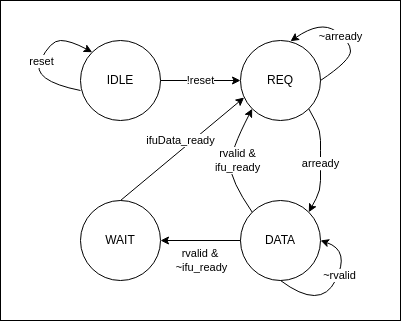

# Core Components

- [Core Components](#core-components)
  - [Introduction](#introduction)
  - [IFU](#ifu)
    - [PC](#pc)
    - [Instruction memory bus](#instruction-memory-bus)

## Introduction

## IFU

IFU contains the PC (Program Counter) register and control logic to for instruction memory AXI4Lite Bus.

### PC

PC is the address to fetch next address and usually increment by 4 when an instruction is fetched from the memory and
sent to the downstream module (a handshake completes). With a successful branch or jump instruction, or a trap, PC
will alter to a new value instead of pc + 4. If the instruction fetching is delayed or the downstream logic is blocked,
pc will keep its value.

### Instruction memory bus

The instruction memory bus is an AXI4Lite bus. A state machine controls the AXI bus logic:

#### IFU state machine for SINGLE/MULTI-CYCLE CPU

State machine

State

| State | Description                                                                          |
| ----- | ------------------------------------------------------------------------------------ |
| IDLE  | **Idle state.**  This is the state when cpu is first boot and/or under reset.        |
| REQ   | **Request state.** Assert the arvalid signal to send the read request to the memory. |
| DATA  | **Data state.**  Wait for the read data from the memory.                             |
| WAIT  | **Wait state.**  Wait for downstream logic to be ready.                              |

State Transition

| Current State | Next State | Condition           | Description                                                             |
| ------------- | ---------- | ------------------- | ----------------------------------------------------------------------- |
| IDLE          | REQ        | !reset              | Once reset is release, goto **REQ** state                               |
| REQ           | DATA       | arready             | AR channel handshake complete.                                          |
| DATA          | REQ        | rvalid & ifu_ready  | Read data is back and downstream logic is able to receive the data      |
| DATA          | WAIT       | rvalid & ~ifu_ready | Read data is back but downstream logic is not able to received the data |
| WAIT          | REQ        | ifu_ready           | Downstream logic is ready                                               |

Note: This state machine only works for single/multi-cycle CPU and it only start to fetch the next instruction when the
current instruction has retired. But for pipelined CPU, we need to fetch the next instruction once the instruction retire
from the IFU itself.

An instructions buffer is used to store the instruction when the downstream logic is not able to take the instruction
when it comes back.