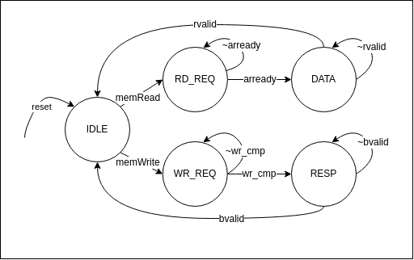

# Core Components

- [Core Components](#core-components)
  - [IFU](#ifu)
    - [Interfaces](#interfaces)
    - [Implementation](#implementation)
  - [IDU](#idu)
    - [Interface](#interface)
    - [Implementation](#implementation-1)
  - [Decoder](#decoder)
    - [Interface](#interface-1)
    - [Implementation](#implementation-2)
  - [Register File](#register-file)
    - [Interface](#interface-2)
    - [Implementation](#implementation-3)
  - [EXU (Single/Multi-cycle CPU)](#exu-singlemulti-cycle-cpu)
    - [Interface](#interface-3)
    - [Implementation](#implementation-4)
  - [ALU](#alu)
    - [Interface](#interface-4)
    - [Implementation](#implementation-5)
  - [BEU](#beu)
    - [Interface](#interface-5)
    - [Implementation](#implementation-6)
  - [LSU](#lsu)
    - [Interface](#interface-6)
    - [Implementation](#implementation-7)
  - [TrapCtrl](#trapctrl)
    - [Interface](#interface-7)
    - [Implementation](#implementation-8)
  - [MulDiv](#muldiv)
    - [Interface](#interface-8)
    - [Implementation](#implementation-9)


## IFU

IFU contains the PC (Program Counter) register and control logic to for instruction memory AXI4Lite Bus.

### Interfaces

| Name       | Width/Type<sup>1</sup> | Direction<sup>2</sup> | Description                                 |
| ---------- | ---------------------- | --------------------- | ------------------------------------------- |
| ifuData    | IfuBundle              | Stream (Host)         | IFU data to next stage                      |
| ibus       | AXI4Lite               | Stream (Host)         | Instruction memory bus - AXI4Lite Interface |
| branchCtrl | xlen bits              | Flow (Device)         | Branch valid and target PC                  |
| trapCtrl   | xlen bits              | Flow (Device)         | Trap valid and target PC                    |

1. SpinalHDL provides a [Bundle](https://spinalhdl.github.io/SpinalDoc-RTD/master/SpinalHDL/Data%20types/bundle.html)
   data type which is a composite type that defines a group of named signals.
1. SpinalHDL library provides two interfaces called [Stream](https://spinalhdl.github.io/SpinalDoc-RTD/master/SpinalHDL/Libraries/stream.html)
   and [Flow](https://spinalhdl.github.io/SpinalDoc-RTD/master/SpinaislHDL/Libraries/flow.html). Stream is a simple
   valid-ready handshake protocol to carry payload. Flow is is a simple valid/payload protocol. The Host and Device are
   the direction of the interfaces. For Stream interface, a valid and a ready signal will be added by SpinalHDL and for
   Flow interface, a valid signal will be added by SpinalHDL.

#### IfuBundle

| Name        | Width | Description                     |
| ----------- | ----- | ------------------------------- |
| pc          | xlen  | Program Counter                 |
| instruction | xlen  | Instruction fetched from memory |

### Implementation

#### PC

PC is the address to fetch next address and usually increment by 4 when an instruction is fetched from the memory and
sent to the downstream module (a handshake completes). With a successful branch or jump instruction, or a trap, PC
will alter to a new value instead of pc + 4. If the instruction fetching is delayed or the downstream logic is blocked,
pc will keep its value.

#### Instruction memory bus

The instruction memory bus is an AXI4Lite bus. A state machine controls the AXI bus logic:

##### IFU state machine for SINGLE/MULTI-CYCLE CPU

State machine


State

| State | Description                                                                          |
| ----- | ------------------------------------------------------------------------------------ |
| IDLE  | **Idle state.**  This is the state when cpu is first boot and/or under reset.        |
| REQ   | **Request state.** Assert the arvalid signal to send the read request to the memory. |
| DATA  | **Data state.**  Wait for the read data from the memory.                             |
| WAIT  | **Wait state.**  Wait for downstream logic to be ready.                              |

State Transition

| Current State | Next State | Condition           | Description                                                             |
| ------------- | ---------- | ------------------- | ----------------------------------------------------------------------- |
| IDLE          | REQ        | !reset              | Once reset is release, goto **REQ** state                               |
| REQ           | DATA       | arready             | AR channel handshake complete.                                          |
| DATA          | REQ        | rvalid & ifu_ready  | Read data is back and downstream logic is able to receive the data      |
| DATA          | WAIT       | rvalid & ~ifu_ready | Read data is back but downstream logic is not able to received the data |
| WAIT          | REQ        | ifu_ready           | Downstream logic is ready                                               |

Note: This state machine only works for single/multi-cycle CPU and it only start to fetch the next instruction when the
current instruction has retired. But for pipelined CPU, we need to fetch the next instruction once the instruction retire
from the IFU itself.

An instructions buffer is used to store the instruction when the downstream logic is not able to take the instruction
when it comes back (downstream logic is back pressuring).

## IDU

### Interface

| Name     | Width/Type | Direction       | Description                      |
| -------- | ---------- | --------------- | -------------------------------- |
| iduData  | IduBundle  | Stream (Host)   | IDU data going to the next stage |
| ifuData  | IfuBundle  | Stream (Device) | IFU data from IFU                |
| rdWrCtrl | RdWrCtrl   | Flow (Device)   | Rd write address and write data  |

#### IduBundle

| Name    | Width/Type | Description                 |
| ------- | ---------- | --------------------------- |
| cpuCtrl | CpuCtrl    | CPU control signals         |
| csrCtrl | CsrCtrl    | CSR module control signals  |
| rs1Data | xlen bits  | RS1 data from register file |
| rs2Data | xlen bits  | RS2 data from register file |
| pc      | xlen bits  | program counter             |

- CpuCtrl is described in [Cpu Control signal (CpuCtrl)](#cpu-control-signal-cpuctrl)
- CsrCtrl is described in [CSR Control signal (CsrCtrl)](#csr-control-signal-csrctrl)

### Implementation

IDU has two major components: Decoder and Register File.

- [Decoder](#decoder) is responsible for decoding the instruction and generate various control signals for the EXU.
- [Register File](#register-file) contains the registers.

## Decoder

Decoder read the instruction and generate various control signals. The Interface session listed all the control signals
generated by the decoder.

### Interface

| Name    | Width/Type | Direction | Description                |
| ------- | ---------- | --------- | -------------------------- |
| ifuData | IfuBundle  | Input     | IFU data from IFU          |
| cpuCtrl | CpuCtrl    | Output    | CPU control signals        |
| csrCtrl | CsrCtrl    | Output    | CSR module control signals |

#### CPU Control signal (CpuCtrl)

When the control signals are assert, it indicate that the CPU will perform a certain operation.

| Name      | Width | Description              |
| --------- | :---: | ------------------------ |
| rdWrite   |   1   | Write to the register    |
| rdAddr    |   5   | Write register address   |
| branch    |   1   | Branch instruction       |
| jump      |   1   | Jump instruction         |
| memRead   |   1   | Memory read              |
| memWrite  |   1   | Memory write             |
| ebreak    |   1   | ebreak instruction       |
| ecall     |   1   | ecall instruction        |
| mret      |   1   | mret instruction         |
| aluSelPc  |   1   | ALU select PC as operand |
| selImm    |   1   | Select Immediate value   |
| aluOpcode |   5   | ALU opcode               |
| opcode    |   3   | opcode                   |
| rs1Addr   |   5   | rs1 register id          |
| rs2Addr   |   5   | rs2 register id          |
| immediate | XLEN  | Immediate value          |
| muldiv    |   1   | Mul or div instruction   |

Note: detailed description of aluOpcode and opcode will be discussed in the [Implementation](#implementation-2) session

#### CSR Control signal (CsrCtrl)

In RTL, CSR related control signal use a separate interface(class)

| Name  | Width | Description                                          |
| ----- | :---: | ---------------------------------------------------- |
| write |   1   | Write the data<sup>1</sup> to CSR                    |
| set   |   1   | Set the CSR register based on the mask<sup>1</sup>   |
| clear |   1   | Clear the CSR register based on the mask<sup>1</sup> |
| read  |   1   | Read the CSR register                                |
| addr  |  12   | CSR register ID                                      |

1. The data and mask are generated by the cpu logic depending on the csr instruction.

### Implementation

#### aluOpcode

The ALU opcode is used by ALU to determines the operation in ALU.
   - aluOpcode[2:0]: Same encoding as the **funct3** field in the instruction. ALU will perform the operation defined in
     the RISC-V spec that match this encoding in **funct3** field.
   - aluOpcode[3]: This bit is used together with aluOpcode[2:0] to distinguish between add/sub, srl(i)/sra(i) since
     they have the same encoding in **funct3** field. This info is encoded in instruction[30].
   - aluOpcode[4]: Encode the LUI instruction for ALU. If aluOpcode[4] = 1, ALU will perform LUI operation regardless of
     other bits in aluOpcode.

Full **aluOpcode** encoding:

| Encoding | Operation |
| -------- | --------- |
| 5'b1XXXX | LUI       |
| 5'b00000 | ADD       |
| 5'b01000 | SUB       |
| 5'b00001 | SLL       |
| 5'b00010 | SLT       |
| 5'b00011 | SLTU      |
| 5'b00100 | XOR       |
| 5'b00101 | SRL       |
| 5'b01101 | SRA       |
| 5'b00110 | OR        |
| 5'b00111 | AND       |

#### opcode

The opcode is used to encode instruction for branch/load/store/rv32m type of instruction. The value is the same as
   **funct3** field since the spec use funct3 to encode these instruction.

Full **opcode** encoding:

| Encoding | Branch | Load | Store | RV32M  |
| -------- | ------ | ---- | ----- | ------ |
| 3'b000   | BEQ    | LB   | SB    | MUL    |
| 3'b001   | BNE    | LH   | SH    | MULH   |
| 3'b010   |        | LW   | SW    | MULHSU |
| 3'b011   |        |      |       | MULHU  |
| 3'b100   | BLT    | LBU  |       | DIV    |
| 3'b101   | BGE    | LHU  |       | DIVU   |
| 3'b110   | BLTU   |      |       | REM    |
| 3'b111   | BGEU   |      |       | REMU   |

## Register File

### Interface

| Name     | Width/Type | Direction     | Description      |
| -------- | ---------- | ------------- | ---------------- |
| rs1Addr  | 5    bits  | input         | rs1 address      |
| rs1Data  | xlen bits  | output        | rs1 read data    |
| rs2Addr  | 5    bits  | input         | rs2 address      |
| rs2Data  | xlen bits  | output        | rs2 read data    |
| rdWrCtrl | RdWrCtrl   | Flow (Device) | rd write control |

#### RdWrCtrl

| Name | Width     | Description      |
| ---- | --------- | ---------------- |
| addr | 5 bits    | Rd write address |
| data | xlen bits | Rd write data    |

### Implementation

Register File contains 32 32-bit registers (RV32I).

Register File has 3 ports: rs1, rs2, and rd ports
- rs1 and rs2 are read ports that returns register value to the given register id. It takes the register id from decoder
  and returns the register value at the same clock cycle.
- rd is a write port that write the execution result back to register file.

R0 is a special register that always return 0 when read. Write to R0 will be ignored.

Because Register File read at the same cycle, it is usually implemented in pure flip flop or SRAM.

## EXU (Single/Multi-cycle CPU)

### Interface

| Name       | Width/Type | Direction       | Description                          |
| ---------- | ---------- | --------------- | ------------------------------------ |
| iduData    | IduBundle  | Stream (Device) | IDU data from IDU                    |
| rdWrCtrl   | RdWrCtrl   | Flow (Host)     | Rd write address and write data      |
| branchCtrl | xlen bits  | Flow (Host)     | Branch valid and target PC           |
| trapCtrl   | xlen bits  | Flow (Host)     | Trap valid and target PC             |
| dbus       | AXI4Lite   | Stream (Host)   | Data Memory bus - AXI4Lite Interface |

### Implementation

In Single/Multi-cycle cpu, EXU is the last stage of the cpu core logic and it contains all the execution units.

#### Execution modules

It Instantiate the following modules: ALU, BEU, LSU, MulDiv, CSR, TrapCtrl. The corresponding control and data signals
are feed into the above modules. Based on the instruction type, one or more of the above modules will be involved for
execution.

#### MUX for ALU
ALU operand may take different sources for different instructions. Two MUXes are used to select different data sources
for ALU.

ALU operand 1 can be rs1 or pc:

| MUX Control  | Sources |
| ------------ | ------- |
| aluSelPc = 1 | pc      |
| aluSelPc = 0 | rs1     |

ALU operand 2 can be rs2 or immediate value.

| MUX Control | Sources   |
| ----------- | --------- |
| selImm = 1  | immediate |
| selImm = 0  | rs2       |

#### MUX for register write back

Rd write back may come from different instruction from different execution sources. The following table listed the
instruction type, execution module and the corresponding control signals.

| Instruction Type | Control Signal                | Result Source      |
| ---------------- | ----------------------------- | ------------------ |
| Mul/Div (RV32M)  | cpuCtrl.muldiv = 1            | MulDiv             |
| Jump             | cpuCtrl.jump = 1              | PC + 4<sup>1</sup> |
| Memory read      | cpuCtrl.memRead = 1           | MEU                |
| CSR read         | csrCtrl.read = 1              | CSR                |
| R,I type         | None of the above<sup>2</sup> | ALU                |

<sup>1</sup>PC+4 is calculated in EXU by a separate logic.

<sup>2</sup>There is no dedicated control signal to indicate R,I type instruction. So ALU will be used at the last
choice if none of the other control signals are valid.

#### Back-pressure

EXU will back-pressure the upstream logic (IDU and IFU) if the instruction can't be completed within the clock cycle.
Currently the mem read and write instruction will need more then 1 clock cycle to complete. Mul/Div also needs more
then 1 clock cycle but we implemented these instructions using verilog operator *, /, and % for now so they only take
1 clock cycle at this point.

## ALU

### Interface

| Name      | Width/Type | Direction | Description                         |
| --------- | ---------- | --------- | ----------------------------------- |
| opcode    | 5 bits     | input     | aluOpcode from Decoder              |
| src1      | xlen bits  | input     | ALU operand 1                       |
| src2      | xlen bits  | input     | ALU operand 2                       |
| result    | xlen bits  | output    | ALU result                          |
| addResult | xlen bits  | output    | dedicated result from add operation |

### Implementation

ALU is responsible for logic and arithmetic operation (excluding Mul/Div). It supports the following operation:

- Logic: XOR, OR, AND
- Arithmetic: ADD (addition), SUB(subtraction)
- Compare: SLT (set less then), SLTU (set less then unsign)
- Shift : SLL (shift left logical), SRL (shift right logical), SRA (shift right arithmetic)
- Other: LUT (Load Upper Immediate)

Most of the above operations are implemented using the corresponding HDL operator that supported by verilog. Except for
the following:

- LUI: LUI result is already generated in Decoder as immediate, so result = rs2
- SLTU: We can check the msb of the subtraction result. If it's 1 then A - B < 0 => A < B.
- SLT: SLT can be divided into two conditions: A < 0 and B > 0 or A and B are both positive/negative and A - B < 0.
  This give us the following equation:  `SLT = ((A.msb & ~B.msb)) | (~( A.msb XOR B.msb) & sub_result.msb)`

All the operations happens in parallel when new data arrives. A MUX selects the corresponding result to the output port
based on the alu opcode. The alu opcode encoding can be found in [aluOpcode](#aluopcode) session.

ALU also has a dedicated output for the add result because some instructions may use ALU to calculate some addition.
The dedicated output for add result help improve timing. These instructions includes:
branch/jump - calculate target address (PC) and memory read/write - calculate address.

## BEU

### Interface

| Name       | Width/Type | Direction   | Description                           |
| ---------- | ---------- | ----------- | ------------------------------------- |
| branch     | 1 bits     | input       | Indicate this is a branch instruction |
| jump       | 1 bits     | input       | Indicate this is a jump instruction   |
| opcode     | 3 bits     | input       | branch opcode                         |
| src1       | xlen bits  | input       | source 1 for branch comparison        |
| src2       | xlen bits  | input       | source 2 for branch comparison        |
| addr       | xlen bits  | input       | new target calculated from ALU        |
| branchCtrl | xlen bits  | Flow (Host) | Branch valid and target address       |

opcode encoding can be found in [opcode](#opcode) session.

### Implementation

BEU is responsible for checking the branch result and generating the new target address.

#### Branch check

For jump instruction, it will always switch to the new address.

For branch instruction, the branch result is checked in BEU. If the check success, it will switch to the new address.

Note that bne, bge, bgeu are the inversion of beq, blt, bltu, and further note that in the opcode encoding, opcode[0]
indicate if it's inverted or not. So we only need logic to check eq, lt, and ltu. If opcode[0] = 1, then invert the
check result. Checks for lt and ltu use the similar simplification mentioned in ALU.

#### Target address

The target address is calculated in ALU and some minor update to the address for jump instruction is made in BEU.

#### Two design choice

Note here we choose to calculate the target address using ALU and check branch result in BEU. Another design choice is
to use ALU to calculate branch result and calculate the target address in BEU. Our choice might have a better timing
result on determines the branch decision.

## LSU

### Interface

| Name     | Width/Type | Direction     | Description                          |
| -------- | ---------- | ------------- | ------------------------------------ |
| dbus     | AXI4Lite   | Stream (Host) | Data Memory Bus - AXI4Lite interface |
| memRead  | 1 bit      | Input         | memory read                          |
| memWrite | 1 bit      | Input         | memory write                         |
| opcode   | 3 bits     | Input         | opcode for memory instruction        |
| addr     | xlen bits  | Input         | memory address                       |
| wdata    | xlen bits  | Input         | memory write data                    |
| rdata    | xlen bits  | Output        | memory read data                     |
| wready   | xlen bits  | Output        | memory write ready                   |
| rvalid   | xlen bits  | Output        | memory read valid                    |

opcode encoding can be found in [opcode](#opcode) session.

### Implementation

LSU stands for Load Store Unit. It's responsible for generating request to the memory and process the read data.
The cpu use AXI4Lite interface for data memory access. In order to support byte access, we introduced `WSTRB`
field in W channel in our AXI4Lite interface.

A state machine is used to control the AXI4Lite bus protocol.

#### LSU State Machine

State machine



State

| State  | Description                                                                                            |
| ------ | ------------------------------------------------------------------------------------------------------ |
| IDLE   | **Idle state.**  This is the state when cpu is first boot and/or under reset.                          |
| RD_REQ | **Read Request state.** Assert the arvalid signal to send the read request to the memory.              |
| WR_REQ | **Write Request state.** Assert the awvalid and wvalid signal to send the write request to the memory. |
| DATA   | **Data state.**  Wait for the read data from the memory.                                               |
| RESP   | **Response state.**  Wait for the write response from the memory.                                      |

State Transition

| Current State | Next State | Condition | Description                          |
| ------------- | ---------- | --------- | ------------------------------------ |
| IDLE          | RD_REQ     | memRead   | Read instruction                     |
| IDLE          | WR_REQ     | memWrite  | Write instruction                    |
| RD_REQ        | DATA       | arready   | AR channel handshake complete.       |
| WR_REQ        | RESP       | wr_cmp    | AW and W channel handshake complete. |
| DATA          | IDLE       | rvalid    | Receive read data                    |
| RESP          | IDLE       | bvalid    | Receive write response               |

For write request, there are two channels: WR and W. WR_REQ can switch to RESP only when both of the AW and W
channel handshake complete. This adds complexity for state control as AW and W channel can back-pressure separately
as per AXI spec. Signal `wr_cmp` is introduced to indicate that both AW and W channel has completed handshake. Two
additional registers `aw_cmp` and `w_cmp` are introduced to indicate that the AW and W channel has completed their
handshake separately.

With the help of the 2 additional register, we can come up with the logic for `wr_cmp`:

```verilog
assign wr_cmp = awready & wready | // both the AW and W channels are ready to receive request
                awready & w_cmp  | // AW channel is ready and W channels has completed the handshake
                wready  & aw_cmp;  // W channel is ready and AW channel has completed the handshake
```

#### Data Processing

Based on the access type (full word, half word or byte). Data needs to be manipulated for both the read and the write.

For read, the read data from the memory needs to be extended based on the instruction type.

For write, the write data need to be places into the bus correctly, and the write strobe (WSTRB) need to be generated.

## TrapCtrl

### Interface

| Name      | Width/Type | Direction   | Description                  |
| --------- | ---------- | ----------- | ---------------------------- |
| csrRdPort | CsrRdPort  | Input       | data read from CSR           |
| csrWrPort | CsrWrPort  | Output      | data write to CSR            |
| ecall     | 1 bit      | Input       | environment call instruction |
| mret      | 1 bit      | Input       | mret  instruction            |
| pc        | xlen bits  | Input       | Current instruction PC       |
| trapCtrl  | xlen bits  | Flow (Host) | Trap valid and target PC     |
| trap      | 1 bits     | Output      | Indicate trap valid          |

#### CsrRdPort

This interface carries some CSR register value. These are needed information for exception/interrupt handling.

| Name  | Width | Description                                   |
| ----- | ----- | --------------------------------------------- |
| mtvec | xlen  | Target PC when exception/interrupt occur      |
| mepc  | xlen  | PC for the instruction that trigger exception |

#### CsrWrPort

This interface carries the status from exception/interrupt. The corresponding CSR registers are updated when exception/
interrupt occurs.

| Name   | Width | Description                                   |
| ------ | ----- | --------------------------------------------- |
| mcause | xlen  | exception/interrupt cause ID                  |
| mepc   | xlen  | PC for the instruction that trigger exception |

### Implementation

This module is responsible for process all the exception and interrupt. The implementation follows the exception and
interrupt handling defined in the RISC-V Spec:

Entering: When an exception/interrupt occurs, the following actions are taken:
1. Update `mepc` CSR register to the PC value of the instruction that triggers the event.
2. Update `mcause` CSR register based on the trigger type.
3. Jump to the new address defined by `mtvec` CSR register.

Exiting: If the instruction is mret, it indicates that exception/interrupt has been processed by OS and the CPU need to
return to previous instruction (or maybe a new instruction):
1. Jump to the address defined by `mepc` CSR register.

## MulDiv

### Interface

| Name   | Width/Type | Direction | Description                 |
| ------ | ---------- | --------- | --------------------------- |
| opcode | 3 bits     | input     | mul/div opcode from Decoder |
| src1   | xlen bits  | input     | operand 1                   |
| src2   | xlen bits  | input     | operand 2                   |
| result | xlen bits  | output    | result                      |

### Implementation

This module is responsible for process multiplication and division instruction in RV32M extension.

Currently the implementation use HDL operator `*`, `/`, and `%` so all the operation is done in the same clock cycle.
This is a temporary implementation to keep the project going without spending too much time on implementing the actual
multiplier and divider. It will be replaced with the real multiplier and divider in later design phase.

#### Resource saving

The instruction have both signed and unsigned operation and they require different hardware. If we go with using different
hardware for them then we will end up having 2 multipliers and 2 dividers. To save resource, it would be preferable to
only use 1 set of multiplier and divider.

In order to achieve that, we can do a small trick. Let's treat all the numbers and operations as signed operation. And
we introduce one more bit to the original input as MSb. This new bit is treated as sign bit for new value. For signed
operation, we do signed extension for this additional bit so the new value is the same as the original value. For unsigned
operation, this additional bit is 0 so the new value is non-negative and it is the same as the original value. Now the
new value is treated as signed value and use signed multiplier and signed divider. At the end, we just discard the
additional bit introduced by adding the "sign" bit.


#### Corner case: divide by zero and overflow

RISC-V Spec defines the behavior for divide by zero case and signed division overflow case.
Signed division overflow occurs only when the most-negative integer is divided by −1.

| Condition              | Dividend         | Divisor | DIVU            | REMU | DIV              | REM |
| ---------------------- | ---------------- | ------- | --------------- | ---- | ---------------- | --- |
| Division by zero       | x                | 0       | 2<sup>L</sup>-1 | x    | -1               | x   |
| Overflow (signed only) | -2<sup>L-1</sup> | -1      | -               | -    | -2<sup>L-1</sup> | 0   |

The div/rem result is calculated first without checking the above condition. Then the conditions are checked generating
two control signals: `zero` and `overflow`. Finally some MUX logic will select correct value as final div and rem output
base on the corner case condition.